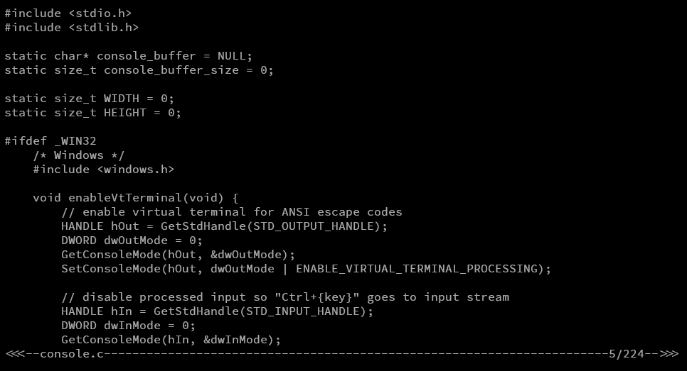

# SE - Text Editor
SE is a lightweight Text Editor
## Features
- **Cross platform compatibility** 
- **Status Bar**
- No Ctrl+C / Ctrl+V support (anti vibecoding)
## Installation
##### with Make
	make
##### without Make
	gcc main.c console.c -Iinclude -o se(.exe)
## Usage
- `se <file_path>`
- `Ctrl+S` to  save the current buffer
- `Ctrl+X` to exit
## Example Screenshot

